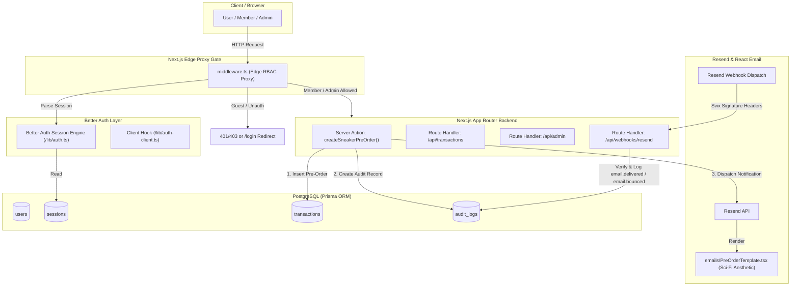

# Step High Sneakers — Backend Architecture & Pipeline (Phase 2)

An enterprise-grade, secure Next.js backend infrastructure pipeline engineered for **Step High Sneakers**. This implementation bridges a normalized relational PostgreSQL schema (Prisma ORM), localized synthetic data ingestion (`@faker-js/faker`), edge-level authenticated Role-Based Access Control (Better Auth + Next.js Middleware), transactional lifecycle notification dispatch (Resend + React Email), and cryptographically verified webhook ingestion (`AuditLog`).

---

## 🏗️ Architecture Blueprint



---

## 📁 Project Structure

```bash
├── actions/
│   └── preorder.ts               # Protected Server Action: RBAC check, Prisma mutation, Resend dispatch, AuditLog
├── app/
│   ├── api/
│   │   ├── admin/
│   │   │   └── route.ts          # Admin-only Route Handler (RBAC guarded)
│   │   ├── auth/
│   │   │   └── [...all]/
│   │   │       └── route.ts      # Better Auth Catch-All API Handler
│   │   ├── transactions/
│   │   │   └── route.ts          # Session-checked Route Handler (scoped isolation for Members, global for Admins)
│   │   └── webhooks/
│   │       └── resend/
│   │           └── route.ts      # Svix-verified Resend Webhook Ingestion (logs to AuditLog)
│   ├── globals.css
│   ├── layout.tsx
│   └── page.tsx                  # Architecture Overview Dashboard
├── emails/
│   └── PreOrderTemplate.tsx      # Dark, sci-fi cyberpunk React Email confirmation template
├── lib/
│   ├── auth.ts                   # Better Auth server configuration with Prisma PostgreSQL adapter
│   ├── auth-client.ts            # Better Auth client for React components
│   ├── prisma.ts                 # Prisma Client singleton
│   └── resend.ts                 # Resend SDK client configuration
├── prisma/
│   ├── schema.prisma             # Multi-entity relational schema (User, Role, Transaction, AuditLog)
│   └── seed.ts                   # Automated localized data ingestion pipeline with @faker-js/faker
├── .env.example                  # Environment variable reference
├── middleware.ts                 # Next.js Edge proxy layer for RBAC verification (Admin, Member, Guest)
├── package.json                  # One-click CLI scripts (db:reset-and-seed) and dependencies
└── tsconfig.json
```

---

## ⚡ Step-by-Step Implementation Details

### Step 1: Part A — Relational Schema Modeling & Automated Mock Data Pipeline (CO4)

1. **Prisma Schema (`prisma/schema.prisma`):**
   - **`User`**: Primary actor model enriched with an explicit `Role` enum (`ADMIN`, `MEMBER`, `GUEST`).
   - **`Transaction`**: Represents sneaker pre-orders. Enforces a strict foreign-key relationship referencing `User.id` (`onDelete: Cascade`), with fields for `orderNumber`, `modelName`, `edition`, `size`, `unitPrice`, `totalAmount`, `status`, and `shippingAddress`.
   - **`AuditLog`**: Centralized event ledger linked to both `User` and `Transaction` via nullable foreign keys (`onDelete: SetNull`). Employs category classification (`TRANSACTION`, `EMAIL_NOTIFICATION`, `AUTH_GATE`, `SYSTEM`) and stores metadata payloads for compliance and observability.

2. **Automated Seeding (`prisma/seed.ts`):**
   - Implements `@faker-js/faker` to programmatically populate localized, realistic users, pre-orders, and audit events.
   - Preserves relational integrity by clearing records in reverse dependency order.
   - Creates deterministic anchor accounts (`admin@stephigh.com`, `member@stephigh.com`, `guest@stephigh.com`) for immediate validation.
   - Populates 15 localized mock accounts with weighted role distribution and 1 to 4 sci-fi sneaker pre-orders per eligible user, alongside paired `AuditLog` entries.

3. **CLI Workflow (`package.json`):**
   - Executes a unified one-click command:
     ```bash
     npm run db:reset-and-seed
     ```
   - Chained internal execution: `prisma migrate reset --force && tsx prisma/seed.ts`.

---

### Step 2: Part B — Authenticated Session Enforcement & Middleware Proxy Gates (CO3)

1. **Better Auth Setup (`lib/auth.ts`, `lib/auth-client.ts`, `app/api/auth/[...all]/route.ts`):**
   - Configures `betterAuth` with `prismaAdapter(prisma, { provider: "postgresql" })`.
   - Enforces role protection by setting `input: false` on the `role` field so users cannot elevate their own permissions during registration.

2. **Middleware Proxy Gate (`middleware.ts`):**
   - Inspects incoming requests at the Next.js Edge runtime using `auth.api.getSession`.
   - **Unauthenticated Users:** Redirected to `/login?redirect=...` (or `401 Unauthorized` for API routes).
   - **GUEST Role:** Denied access to `/preorders` and `/api/transactions` (redirected to `/unauthorized?reason=guest_upgrade_required` or `403 Forbidden`).
   - **MEMBER Role:** Allowed access to pre-orders and transaction query routes; blocked from `/admin` and `/api/admin`.
   - **ADMIN Role:** Granted complete access to administrative analytics and order management.

3. **Protected Endpoints:**
   - **Route Handler (`app/api/transactions/route.ts`):** Enforces defense-in-depth role verification. Members receive only their own isolated transactions; Admins receive system-wide transactions with associated audit records.
   - **Server Action (`actions/preorder.ts`):** Enforces `'use server'` role checks. Rejects Guests, creates the pre-order atomically in PostgreSQL, dispatches the confirmation email, and writes lifecycle records to `AuditLog`.

---

### Step 3: Part C — Transactional Lifecycle Dispatch via Resend & React Email (CO3, CO4)

1. **React Email Template (`emails/PreOrderTemplate.tsx`):**
   - Custom-engineered using `@react-email/components`.
   - Matches the Step High brand identity: `#050608` deep dark background, neon cyan `#00F0FF` accents, high-contrast monospace typographic matrices, and logistics coordinates.

2. **Transactional Dispatch (`actions/preorder.ts`):**
   - Invoked immediately upon a successful sneaker pre-order Prisma mutation.
   - Dispatches via `resend.emails.send(...)` and logs an initial `EMAIL_DISPATCHED` audit entry holding the `resendMessageId`.

3. **Webhook Ingestion Endpoint (`app/api/webhooks/resend/route.ts`):**
   - Verifies incoming Svix cryptographic signatures (`svix-id`, `svix-timestamp`, `svix-signature`) using `RESEND_WEBHOOK_SECRET`.
   - Handles `email.delivered` and `email.bounced` events.
   - Matches the recipient's email address to the database and records immutable audit records into the `AuditLog` table.

---

## 🚀 Setup & Execution Guide

### 1. Install Dependencies
```bash
npm install
```

### 2. Environment Variables
Create a `.env` file from `.env.example`:
```bash
cp .env.example .env
```
Fill in your PostgreSQL connection string, `BETTER_AUTH_SECRET`, and `RESEND_API_KEY`.

### 3. Run Migrations and Seeding Pipeline
```bash
# Push schema or run migration
npx prisma db push

# Run the automated seeding script
npm run db:reset-and-seed
```

### 4. Start Development Server
```bash
npm run dev
```
Open [http://localhost:3000](http://localhost:3000) to inspect the dashboard.
